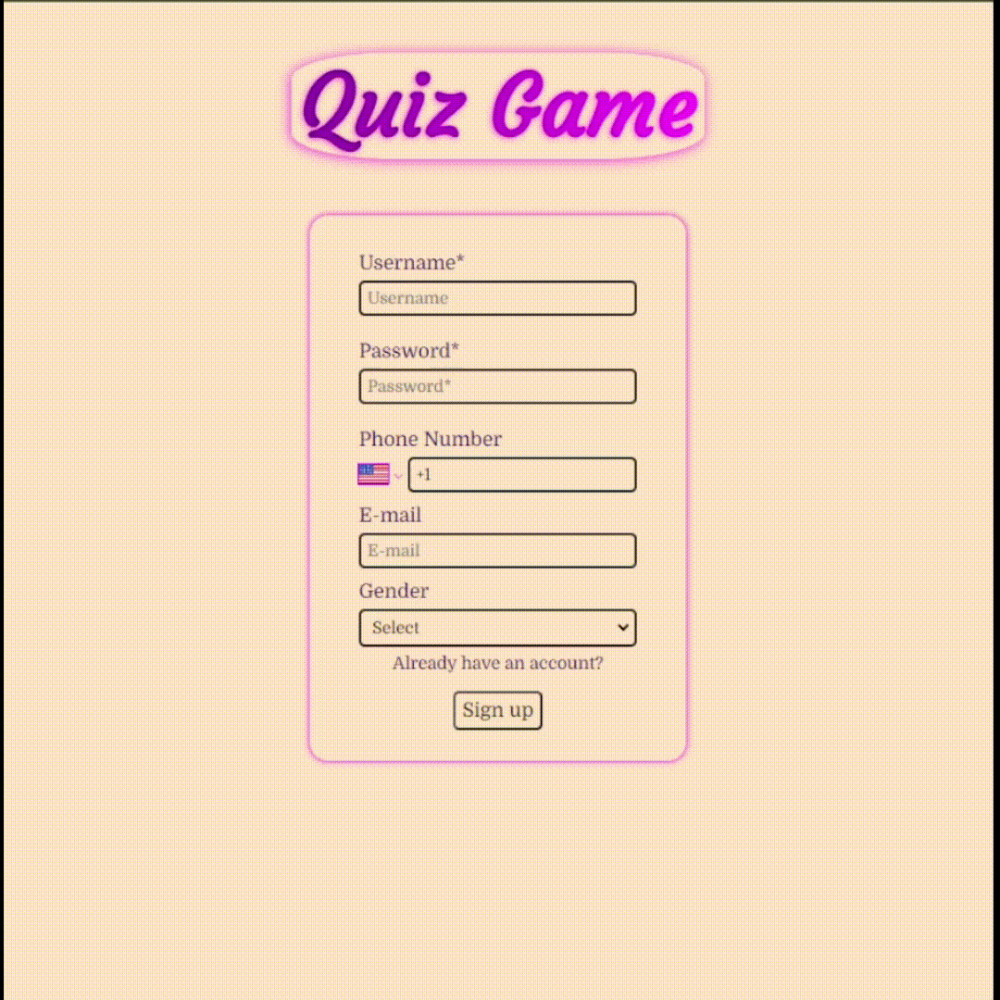
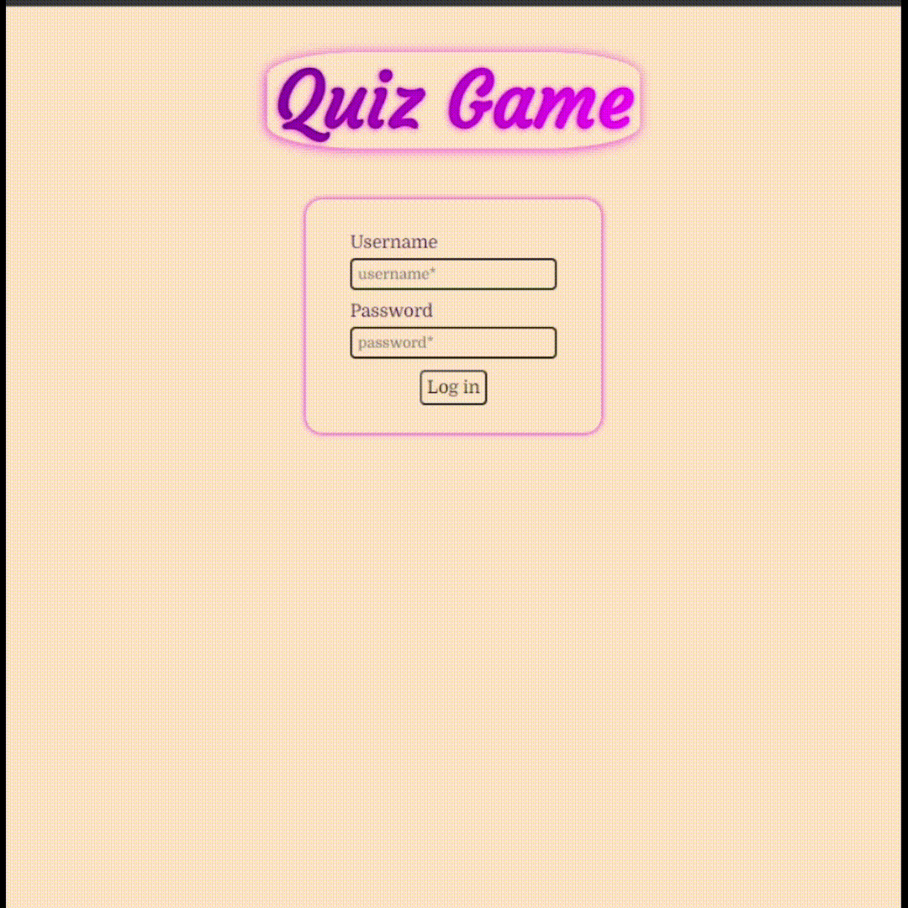
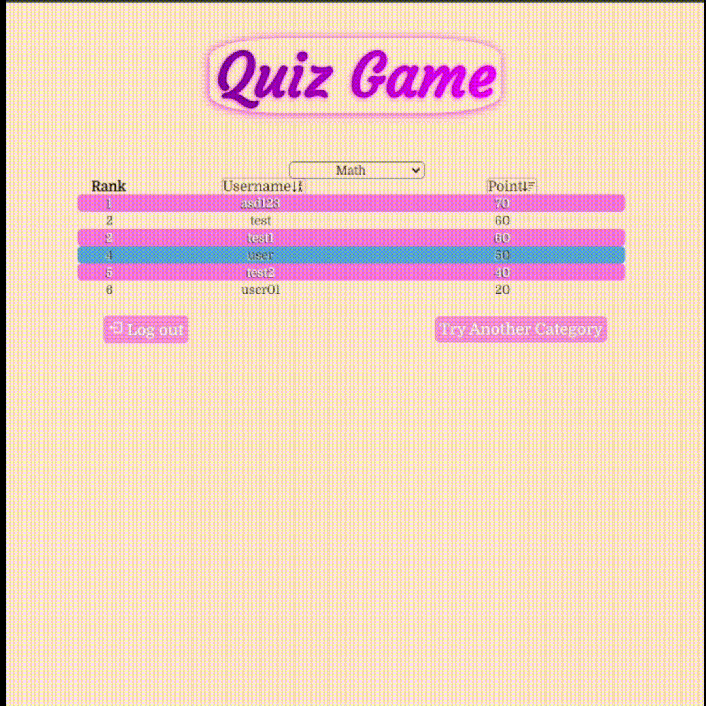

# Quiz Game Project With React

## Overview
This project includes an interactive quiz game. Users can test their knowledge by answering questions in different categories. User accounts are created, and answers for each question in the categories are saved under that account. The application is also preview-friendly. Completed categories can be viewed on the scoreboard page, allowing users to compare their scores.


## Getting Started

To run the project on your local machine, follow the steps below.

### Requirements

- Node.js
- npm

## Installation

Follow these steps to set up and run the project locally:

1. Clone this repository.
    ```bash
    git clone https://github.com/enestalayy/Quiz-Game.git
    ```

2. Navigate to the project directory.
    ```bash
    cd quiz-game
    ```

3. Install dependencies.
    ```bash
    npm install
    ```

4. Start the application.
    ```bash
    npm start
    ```


## Features

### 1. Form Error Display

This feature enhances the user experience by providing real-time feedback on form validation. Key aspects include:

- **On Blur Error Display:** When a form element loses focus (onBlur), the application performs data validation. If an error is detected, relevant error messages are dynamically displayed.

- **On Focus Error Concealment:**  To maintain a clean and unobtrusive interface, error messages disappear as soon as a user interacts with the form element (onFocus).

    <p align="center">
    
    </p>
---

### 2. Save and Resume Session

This feature automatically saves all user selections and data while filling out the form, allowing the user to resume from where they left off upon logging out. Key features include:

- **Real-time Session Recording:** Every choice and input made by the user during form completion is instantly recorded. This ensures no data loss even in scenarios like browser refresh or page exit.

- **Resume Capability:** Users can seamlessly continue from where they left off during their next visit. They can review previous selections, remaining time, and completed questions for a smooth experience.

    <p align="center">
    
    </p>
---

### 3. Keyboard-Only Interaction (Keydown Feature)

This feature enhances the user experience by providing full functionality through keyboard-only interactions. Users can perform various tasks using keyboard shortcuts, especially with arrow keys, ensuring a seamless and accessible experience. Key functionalities include:

- **Registration and Login:** Users can navigate through the registration and login processes using keyboard shortcuts without the need for a mouse.

- **Category Selection:** Easily switch between different categories using arrow keys for efficient navigation.

- **Question Navigation:** Move through questions and mark them for later using keyboard shortcuts, optimizing the user's workflow.

- **Scoreboard Interaction:** Change categories and sorting options on the scoreboard without relying on mouse input.

    <p align="center">
    
    </p>
---

### 4. Secure User Data Storage with Session Storage

To ensure a secure and seamless user experience, the project employs Session Storage for storing user data such as IDs, passwords, and usernames directly in the browser. The primary motivations for utilizing Session Storage are:

- **Client-Side Storage:** Session Storage allows for the storage of essential user data directly on the client side, reducing the need for frequent server requests and enhancing performance.

- **No Permanent Data Persistence:** Unlike local storage, Session Storage provides a temporary data storage solution. User data is retained only for the duration of the user's session, minimizing the risk associated with long-term data persistence.

- **Enhanced Security:** Storing sensitive information like IDs and passwords on the client side ensures that this data is not transmitted over the network regularly. It adds an extra layer of security by reducing exposure to potential network vulnerabilities.

- **Efficient State Management:** Session Storage proves to be efficient for managing user state across various components and pages, offering a consistent and smooth user experience.

- **No Cross-Domain Leakage:** Session Storage is isolated to a single tab and is not shared across different tabs or windows, preventing unintentional data leakage between different domains.

---

### 5. Diverse Question Types and Answer Options

Enhancing the quiz experience, the project incorporates three distinct question types, each with unique answer selection methods. This feature adds variety and fun for users by presenting questions in different styles:

- **Checkbox Questions (Multiple Correct Answers):** Users can encounter questions with multiple correct options. The answers for these questions are stored as an array, allowing for flexibility in selecting more than one correct choice.

- **Radio Questions (Single Correct Answer):** Some questions require users to choose a single correct answer. The corresponding data type for these questions is a string, capturing the chosen option uniquely.

- **Dropdown Questions (Single Correct Answer):** Users may also come across questions presented as dropdown lists. These questions store their answers as numbers, corresponding to the selected option index.

This diversity in question types not only adds an element of surprise but also caters to different preferences and learning styles.

---

### 6. Enhanced Scoreboard Display

In the scoreboard section, special attention has been given to providing users with a personalized and intuitive experience. This feature ensures users can easily identify their own entries and customize their view based on preferences:

- **Distinct User Highlighting:** To facilitate self-recognition, a user's entry is displayed in a distinctive color on the scoreboard. This allows users to quickly spot their own scores amidst the list.

- **Category-Specific Scoreboards:** Users have the flexibility to view scoreboards specific to their chosen category. This tailored approach enhances user engagement by allowing them to focus on areas of interest.

- **Sortable Scoreboard:** The scoreboard can be sorted based on different criteria such as username or score. Users can easily toggle between sorting options, providing a dynamic and customizable viewing experience.

<p align="center">
  
</p>
---

## Technologies

This project utilizes a variety of technologies and libraries to create a seamless and engaging user experience. Here is a list of the main technologies and dependencies used:

- **React (v18.2.0):** A JavaScript library for building user interfaces. React enables the creation of interactive and dynamic components, providing a modern and efficient UI development experience.

- **React Router DOM (v6.16.0):** A routing library for React applications that helps manage navigation and URL changes in a single-page application.

- **Redux Toolkit (v1.9.7):** A set of tools and guidelines for efficient Redux development, simplifying state management in React applications.

- **React Redux (v8.1.3):** The official React bindings for Redux, enabling seamless integration of Redux state management in React applications.

- **Axios (v1.6.1):** A promise-based HTTP client for making asynchronous requests. Axios is used for handling API calls and managing data retrieval.

- **Json Server (v0.17.4):** A simple and fast JSON-based REST API server. Json Server is employed for mocking a backend server, allowing local development and testing of API functionalities.

- **React Icons (v4.11.0):** A library providing a comprehensive set of customizable icons for React applications.

- **React Phone Number Input (v3.3.7):** A React component for entering and validating international phone numbers, enhancing the user experience during phone number input.

- **Testing Libraries (Jest-Dom, React, User-Event) (v5.17.0, v13.4.0, v13.5.0):** A set of libraries for testing React components, ensuring the reliability and stability of the application.

- **Prettier (v3.0.3):** A code formatter that helps maintain consistent and readable code across the project.

- **Eslint (React-App, Jest) Config (v9.0.0):** A tool for identifying and fixing common coding issues, ensuring adherence to coding standards.

These technologies collectively contribute to the project's robustness, maintainability, and overall user satisfaction.

---